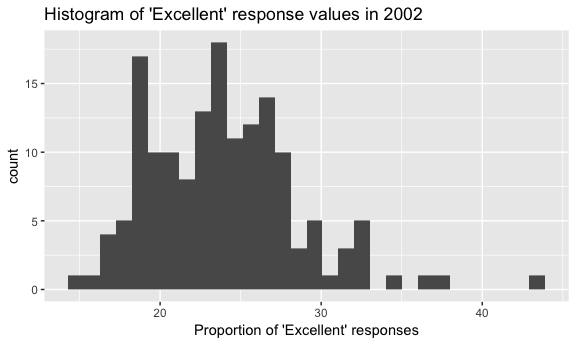
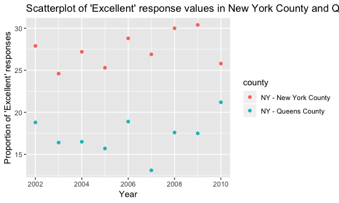

HW \#2
================
Ashley Kang

Problem 1
---------

This problem focuses on NYC Transit data on entrances and exits of each subway station in NYC

### Reading and cleaning data

-   Read and clean the data
-   Retain line, station name, station latitude/longitude, routes served, entry, vending, entrance type, and ADA compliance.
-   Convert the entry variable from character to a logical variable

``` r
nyc_transit_data = read_csv(file = "./data/NYC_Transit_Subway_Entrance_And_Exit_Data.csv") %>%
  janitor::clean_names() %>%
  select("line", "station_name", "station_latitude", "station_longitude", "route1":"route11", "entry", "vending", "entrance_type", "ada") %>% 
  mutate(entry = recode(entry, YES = TRUE, NO = FALSE))
```

    ## Parsed with column specification:
    ## cols(
    ##   .default = col_character(),
    ##   `Station Latitude` = col_double(),
    ##   `Station Longitude` = col_double(),
    ##   Route8 = col_integer(),
    ##   Route9 = col_integer(),
    ##   Route10 = col_integer(),
    ##   Route11 = col_integer(),
    ##   ADA = col_logical(),
    ##   `Free Crossover` = col_logical(),
    ##   `Entrance Latitude` = col_double(),
    ##   `Entrance Longitude` = col_double()
    ## )

    ## See spec(...) for full column specifications.

The `nyc_transit_data` dataset contains **1868 rows** and **19 columns**. This dataset consists of character variables such as `line` and `station_name` that describe the name of the station and where the line runs and coordinate variables (numeric) such as `station_latitutde` and `station_longitude` that describe the location of the entrance/exit of each station. Variables `route1` - `route11` (some character, some integers) tell us which trains (e.g. A, B, Q, 4, etc.) run through each station. Other variables including `vending` (character), `entrance_type`(character), `ada` (logical) and `entry` - which was converted from a character variable to a logical variable - were also included in the dataset.

The dataset was read in and `janitor::clean_names()` was utilized to clean the variable names. Next, `select` was implemented to select the above variables. Lastly, the `entry` variable was converted from a character to a logical variable by using `mutate` and `recode`. Yes, the data are tidy.

#### Answer the following questions:

##### How many distinct stations are there?

``` r
dist_num_station = (distinct(nyc_transit_data, station_name, line))
```

There are **465** distinct stations.

##### How many stations are ADA compliant?

``` r
ada_station = distinct(nyc_transit_data, station_name, line, ada) %>%
  filter(ada == TRUE)
```

There are **84** distinct ADA compliant stations.

##### What proportion of station entrances/exits without vending allow entrance?

``` r
no_vending = filter(nyc_transit_data, vending == "NO")
allow_entrance = filter(no_vending, entry == TRUE)
```

The proportion of station entrances/exits without vending that allow entrance is **0.3770492** (= **37.7%**).

### Reformatting data

Reformat so that route number and route name are distinct variables

``` r
route_reformat = nyc_transit_data %>%
  gather(key = route_number, value = route_name, route1:route11)
```

##### How many distinct stations serve the A train?

``` r
dist_a_station = distinct(route_reformat, line, station_name, .keep_all = TRUE) %>%
  filter(route_name == "A")
```

There are **60** distinct stations that serve the A train.

##### Of the stations that serve the A train, how many are ADA compliant?

``` r
dist_ada_a_station = filter(dist_a_station, ada == TRUE)
```

Of the distinct stations that serve the A train, there are **17** ADA compliant stations.

Problem 2
---------

This problem uses the Mr. Trash Wheel dataset

### Reading and cleaning data

-   Specify the sheet in the Excel file and to omit columns containing notes
-   Use reasonable variable names
-   Omit rows that do not include dumpster-specific data
-   Round the number of sports balls to the nearest integer and converts the result to an integer variable

``` r
trash_wheel_data = readxl::read_excel("./data/HealthyHarborWaterWheelTotals2018-7-28.xlsx", sheet = "Mr. Trash Wheel", range = cellranger::cell_cols("A:N")) %>%
  janitor::clean_names() %>%
  filter(!is.na(dumpster)) %>%
  mutate(sports_balls = round(sports_balls)) %>%
  mutate(sports_balls = as.integer(sports_balls))
```

#### Read and clean precipitation data for 2016 and 2017

Omit rows without precipitation data and add a variable year

##### Precipitation data (2016)

``` r
precipit_16 = readxl::read_excel("./data/HealthyHarborWaterWheelTotals2018-7-28.xlsx", sheet = "2016 Precipitation", range = cellranger::cell_cols("A:B")) %>%
  janitor::clean_names() 

names(precipit_16) = precipit_16[1,]  
precipit_16 = precipit_16[-c(1),]

precipit_2016 = precipit_16 %>% 
  filter(!is.na(Total)) %>%
  filter(!is.na(Month)) %>%
  mutate(Year = "2016")
```

##### Precipitation data (2017)

``` r
precipit_17 = readxl::read_excel("./data/HealthyHarborWaterWheelTotals2018-7-28.xlsx", sheet = "2017 Precipitation", range = cellranger::cell_cols("A:B")) %>%
  janitor::clean_names() 

names(precipit_17) = precipit_17[1,]  
precipit_17 = precipit_17[-c(1),]

precipit_2017 = precipit_17 %>% 
  filter(!is.na(Total)) %>%
  filter(!is.na(Month)) %>%
  mutate(Year = "2017")
```

##### Combine datasets and convert month to a character variable

``` r
precipit_combined = left_join(precipit_2016, precipit_2017, by = "Month") %>%
  rename(Total_2016 = Total.x, Total_2017 = Total.y) %>%
  select(-Year.x, -Year.y) %>%
  mutate(Month = month.name) %>% 
  mutate(Total_2016 = as.numeric(Total_2016)) %>% 
  mutate(Total_2017 = as.numeric(Total_2017))
```

##### Variables for descriptive statistics

``` r
total_tons = trash_wheel_data %>% 
  pull(weight_tons) %>% 
  sum(na.rm = TRUE)

total_homes_powered = trash_wheel_data %>% 
  pull(homes_powered) %>% 
  sum(na.rm = TRUE) %>% 
  round()

sports_balls_2016 = trash_wheel_data %>% 
  filter(year == 2016) %>% 
  pull(sports_balls) %>% 
  median(na.rm = TRUE)
```

The `trashwheel` dataset contains **285 observations** and **14 variables**. This dataset consists of variables such as `dumpster`, `month`, `year` and `date` that describe the dumpster number and trash collection dates. Variables such as `weight_tons` and `volume_cubic_yards` describe the dimensions/properties of the contents of dumpster and variables such as `plastic_bottles`, `polystyrene`, `cigarette_butts`, `glass_bottles`, `grocery_bags`, `chip_bags`, and `sports_balls` describe the litter type. `homes_powered` describe the number of homes in Maryland that can be powered by the energy that is created from incinerating the trash. The *median* number of sports balls in a dumpster in 2016 was **26**. Mr. Trash Wheel has collected **934.94** tons of trash from May 2016 to the end of July 2018 and has powered **1.195110^{4}** homes in Maryland.

The `precipit_2016` dataset contains **12 observations** and the `precipit_2017` dataset contains **12 observations**. The key variables are `month`, `Total_2016`, and `Total_2017`. The total precipitation in 2017 is **32.93**

Problem 3
---------

This problem uses the BRFSS data

##### Loading BRFSS data from `p8105.datasets` package

``` r
devtools::install_github("p8105/p8105.datasets")
```

    ## Skipping install of 'p8105.datasets' from a github remote, the SHA1 (21f5ad1c) has not changed since last install.
    ##   Use `force = TRUE` to force installation

``` r
library(p8105.datasets)
data(brfss_smart2010)
```

##### Formating BRFSS dataset

-   Format the data to use appropriate variable names
-   Focus on the “Overall Health” topic
-   Exclude variables for class, topic, question, sample size, and everything from lower confidence limit to GeoLocation
-   Structure data so that values for Response (“Excellent” to “Poor”) are column names / variables which indicate the proportion of subjects with each response (which are values of Data\_value in the original dataset)
-   Create a new variable showing the proportion of responses that were “Excellent” or “Very Good”

``` r
brfss_data = brfss_smart2010 %>% 
  janitor::clean_names() %>% 
  filter(topic == "Overall Health") %>% 
  select(-class, -topic, -question, -sample_size, -(confidence_limit_low:geo_location)) %>% 
  spread(key = response, value = data_value) %>% 
  janitor::clean_names() %>% 
  mutate(prop_excellent_very_good = (excellent + very_good) / (excellent + fair + good + poor + very_good)) %>% 
  rename(state = locationabbr, county = locationdesc)
```

#### Answer the following questions:

##### How many unique locations are included in the dataset? Is every state represented? What state is observed the most?

``` r
# Unique locations
distinct(brfss_data, county)
```

    ## # A tibble: 404 x 1
    ##    county                     
    ##    <chr>                      
    ##  1 AK - Anchorage Municipality
    ##  2 AL - Jefferson County      
    ##  3 AR - Pulaski County        
    ##  4 AZ - Maricopa County       
    ##  5 AZ - Pima County           
    ##  6 CA - Los Angeles County    
    ##  7 CO - Adams County          
    ##  8 CO - Arapahoe County       
    ##  9 CO - Denver County         
    ## 10 CO - Jefferson County      
    ## # ... with 394 more rows

``` r
# States that are represented
distinct(brfss_data, state)
```

    ## # A tibble: 51 x 1
    ##    state
    ##    <chr>
    ##  1 AK   
    ##  2 AL   
    ##  3 AR   
    ##  4 AZ   
    ##  5 CA   
    ##  6 CO   
    ##  7 CT   
    ##  8 DC   
    ##  9 DE   
    ## 10 FL   
    ## # ... with 41 more rows

``` r
# Count of states
brfss_data %>% 
  count(state)
```

    ## # A tibble: 51 x 2
    ##    state     n
    ##    <chr> <int>
    ##  1 AK       11
    ##  2 AL       18
    ##  3 AR       21
    ##  4 AZ       32
    ##  5 CA       52
    ##  6 CO       59
    ##  7 CT       47
    ##  8 DC        9
    ##  9 DE       27
    ## 10 FL      122
    ## # ... with 41 more rows

There are **404** unique locations included in the dataset. **51** states are represented, which means all 50 states and Washington D.C were included in the dataset. New Jersey is the most observed state, with 146 observations in the dataset.

##### In 2002, what is the median of the “Excellent” response value?

``` r
median_excellent_2002 = brfss_data %>% 
  filter(year == 2002) %>% 
  pull(excellent) %>% 
  median(na.rm = TRUE)
```

The median excellent response value in 2002 is **23.6**.

##### Make a histogram of “Excellent” response values in the year 2002.

Below is a histogram of "Excellent" response values

``` r
brfss_data %>% 
  filter(year == 2002) %>% 
  ggplot(aes(x = excellent)) + 
  geom_histogram() + 
  labs(title = "Histogram of 'Excellent' response values in 2002", x = "Proportion of 'Excellent' responses")
```

    ## `stat_bin()` using `bins = 30`. Pick better value with `binwidth`.

    ## Warning: Removed 2 rows containing non-finite values (stat_bin).



##### Make a scatterplot showing the proportion of “Excellent” response values in New York County and Queens County (both in NY State) in each year from 2002 to 2010.

``` r
brfss_data %>% 
  filter(county == "NY - New York County" | county == "NY - Queens County") %>% 
  ggplot(aes(x = year, y = excellent)) +
  geom_point(aes(color = county)) +
  labs(title = "Scatterplot of 'Excellent' response values in New York County and Queens from 2002-2010", x = "Year", y = "Proportion of 'Excellent' responses" )
```


